# ชุด UML สำหรับนำไปวางรายงาน

ระบบยืม–คืนอุปกรณ์ IoT มีผู้ใช้สองบทบาท คือผู้ใช้ทั่วไปและผู้ดูแล ผู้ใช้ค้นหาและยืมอุปกรณ์ ส่งคำขอคืนตามจำนวนและสภาพ และติดตามประวัติ ผู้ดูแลจัดการอุปกรณ์ ตรวจรับของจริง ส่งคำขอกลับแก้ไข ปิดงานซ่อม จัดการบัญชี และออกรายงาน ระบบปรับจำนวนอุปกรณ์เมื่อยืมหรือเมื่อผู้ดูแลตรวจรับคืนแล้ว

ภาพ PNG ในโฟลเดอร์ `uml-images` เหมาะสำหรับแทรกใน Word/Google Docs ส่วน SVG ใช้เมื่ออยากขยายภาพโดยไม่เสียความคมชัด ไฟล์ `.puml` ใน `docs` เป็นต้นฉบับที่แก้ไขได้ หัวข้อด้านล่างเป็นคำบรรยายภาพที่คัดลอกไปใช้ได้ทันที

## ภาพที่ 1 Use Case Diagram

ภาพรวม Use Case ทั้ง 22 กรณี แสดงผู้เกี่ยวข้องและขอบเขตของระบบ ใช้ภาพเต็มเมื่อหน้ากระดาษใหญ่พอ; หากใช้ A4 ให้ใช้ภาพ 1.1 และ 1.2 แยกหน้าเพื่อให้อ่านข้อความได้

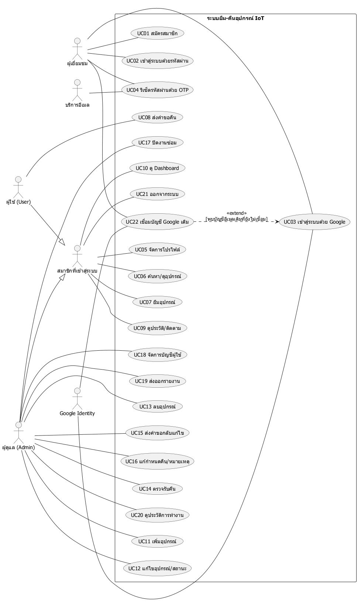

### ภาพที่ 1.1 Use Case ของผู้เยี่ยมชมและผู้ใช้ทั่วไป

ผู้เยี่ยมชมสมัคร เข้าสู่ระบบ และรีเซ็ตรหัสผ่านได้ เมื่อเข้าสู่ระบบแล้ว สมาชิกดูอุปกรณ์ ยืม และดูประวัติได้ ส่วน User ส่งคำขอคืนเพื่อรอ Admin ตรวจรับ การเชื่อมบัญชี Google เดิมเป็นกรณีขยายของการเข้าสู่ระบบด้วย Google เมื่อพบอีเมลเดิมที่ยังไม่ผูก

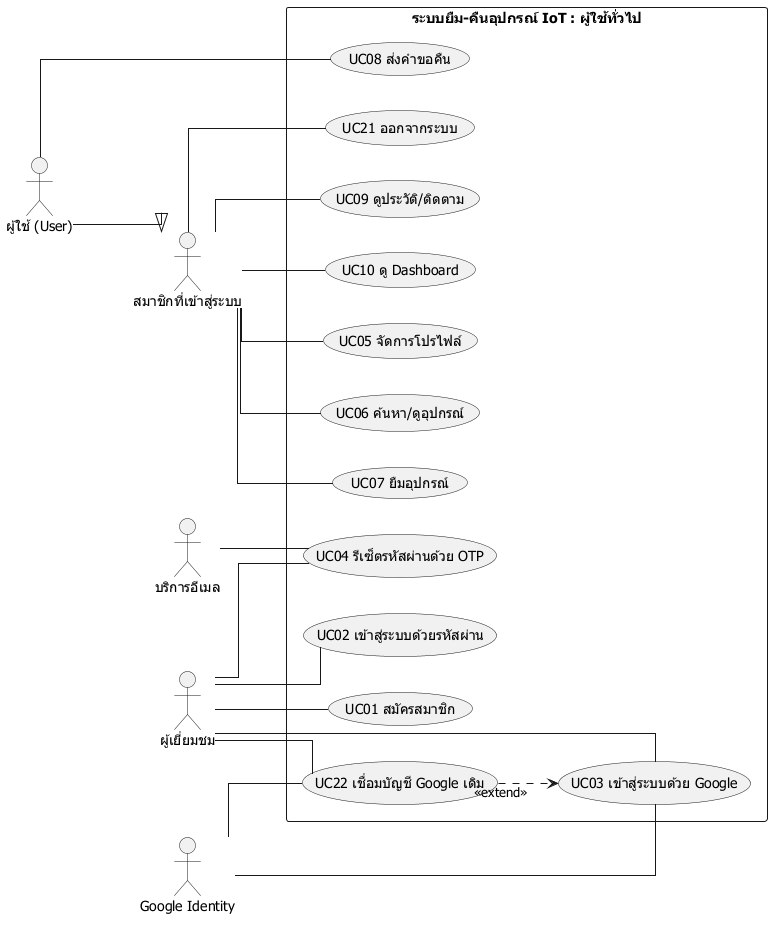

### ภาพที่ 1.2 Use Case เพิ่มเติมของผู้ดูแล

ผู้ดูแลมีสิทธิ์จัดการคลัง ผู้ใช้ การตรวจรับคืน ซ่อม รายงาน และ Audit และยังใช้ฟังก์ชันร่วมของสมาชิกได้

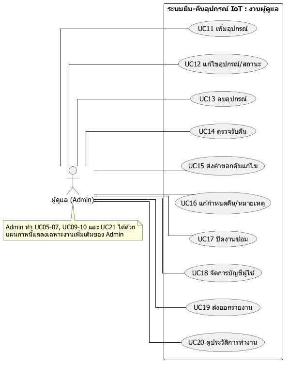

**ตารางอธิบาย Use Case ครบทุกกรณี:** [เปิดเอกสารรายตัว UC01–UC22](uml-use-case-specifications.md) แต่ละรายการมี Actor, Trigger, Preconditions, Main Flow, Exceptional Flow และ Postconditions พร้อมนำไปวางใต้ภาพ Use Case

## ภาพที่ 2 Class Diagram

แสดงข้อมูลหลัก `User`, `Equipment`, `Loan` และส่วนประกอบที่เกี่ยวข้อง ความสัมพันธ์ User–Loan คือผู้ยืมหนึ่งคนมีรายการยืมได้หลายรายการ และ Equipment หนึ่งชนิดมีรายการยืมได้หลายรายการ `PendingReturn` เป็นข้อมูลฝังใน `Loan` ระหว่างรอตรวจรับ เมธอดในภาพเป็นความรับผิดชอบเชิงแนวคิดของโดเมน; โค้ดจริงใช้ Express routes และ SQL

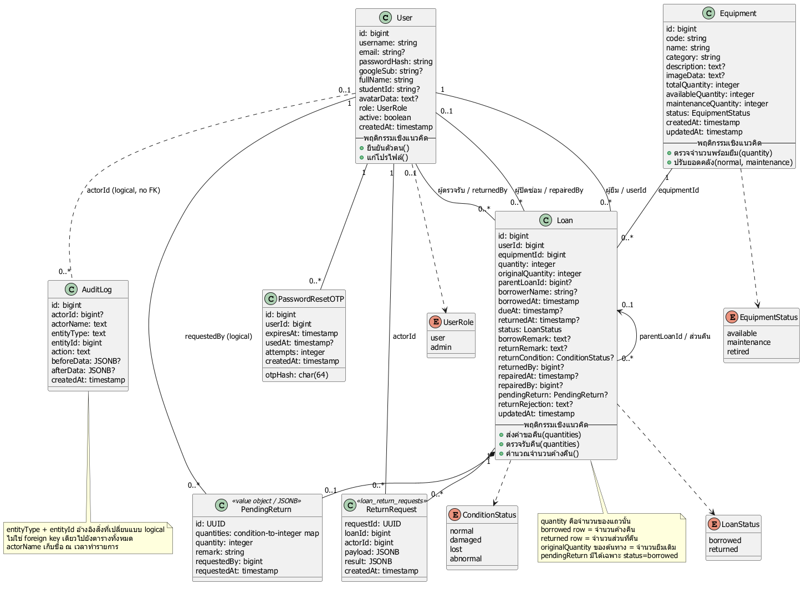

## ภาพที่ 3 Sequence Diagram

ภาพ 3.1 แสดงการโต้ตอบระดับ OOA ระหว่างผู้ยืม ผู้ดูแล และระบบในการส่งคำขอคืนและตรวจรับ ส่วนภาพ 3.2–3.4 แสดงลำดับภายในระดับ OOD สำหรับยืม คืน และซ่อม

### ภาพที่ 3.1 System Sequence Diagram — ส่งคืนและตรวจรับ

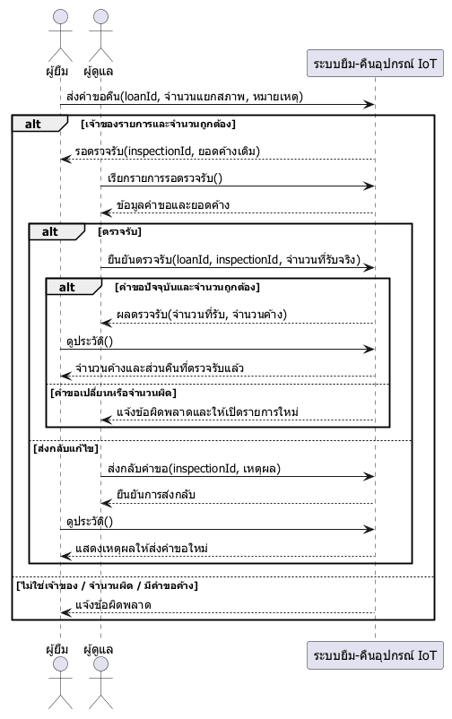

### ภาพที่ 3.2 Sequence Diagram — ยืมอุปกรณ์

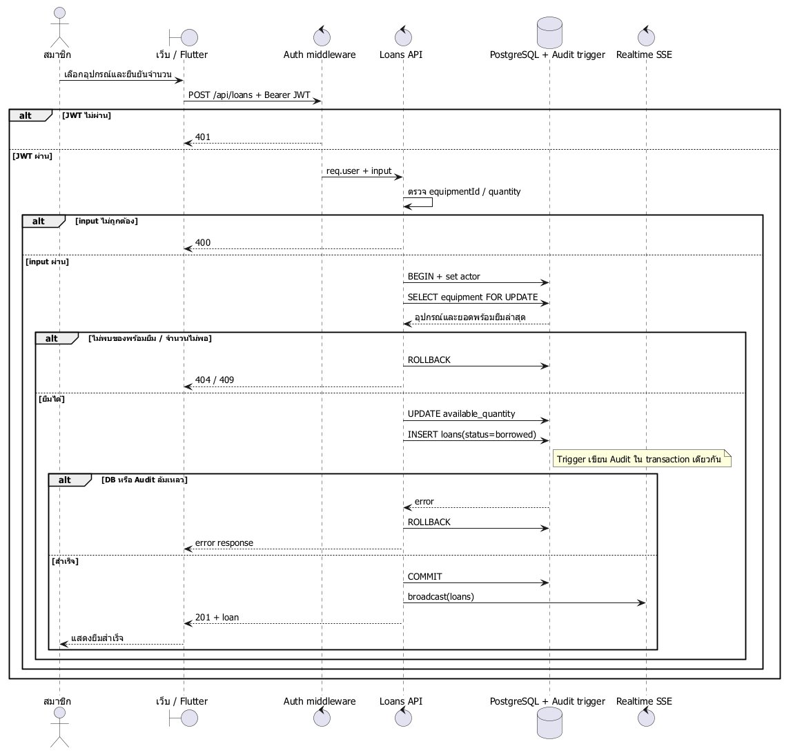

### ภาพที่ 3.3 Sequence Diagram — คำขอคืนและการตรวจรับ

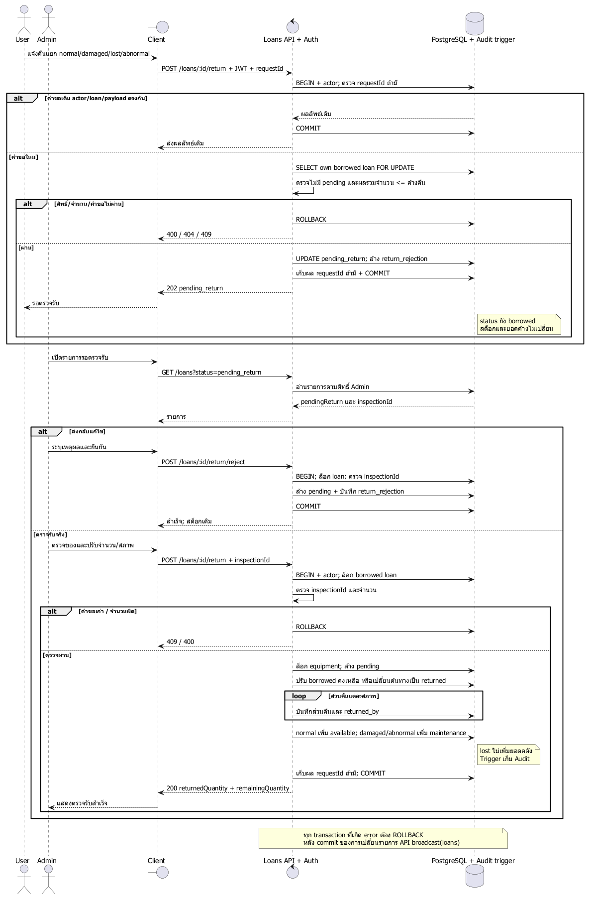

### ภาพที่ 3.4 Sequence Diagram — ปิดงานซ่อม

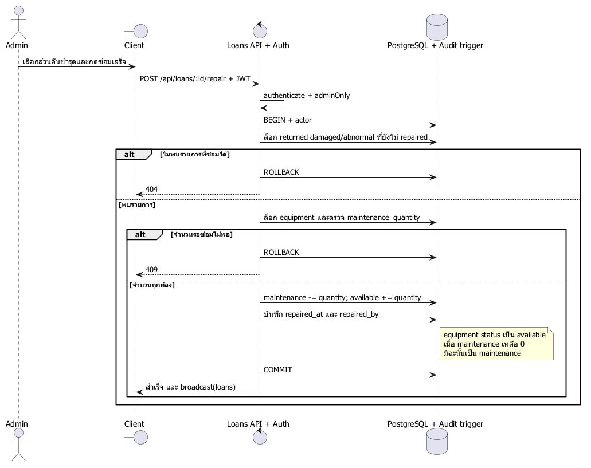

## ภาพที่ 4 Activity Diagram

แสดงงานตั้งแต่ยืม ส่งคำขอคืน ตรวจรับ คืนบางส่วน และซ่อม โดยแบ่ง lane ตามผู้รับผิดชอบ เงื่อนไขสำคัญคือเมื่อ User ส่งคำขอคืน สต็อกและยอดค้างยังไม่เปลี่ยน; ระบบปรับจำนวนหลัง Admin ตรวจรับจริง

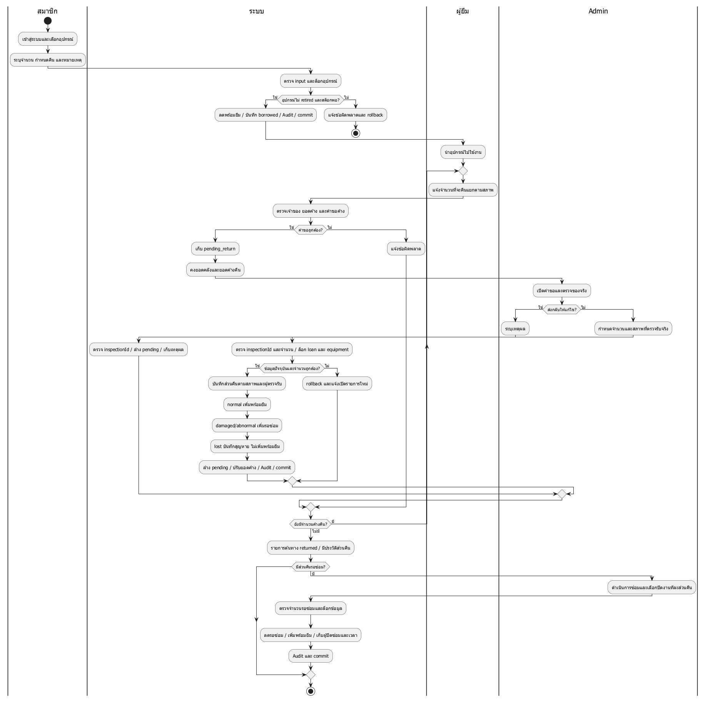

## ภาพที่ 5 State Diagram

ภาพ 5.1 แสดงสถานะเชิงธุรกิจของรายการยืม ได้แก่ กำลังยืม รอตรวจรับ และคืนครบ โดยสถานะรอตรวจรับมาจาก `pending_return` ขณะที่ค่า `loans.status` ยังเป็น `borrowed` ภาพ 5.2 แสดงวงจรของส่วนคืนตามสภาพ โดยชำรุด/ผิดปกติเปลี่ยนจากรอซ่อมเป็นซ่อมเสร็จได้

### ภาพที่ 5.1 State Diagram — รายการยืม

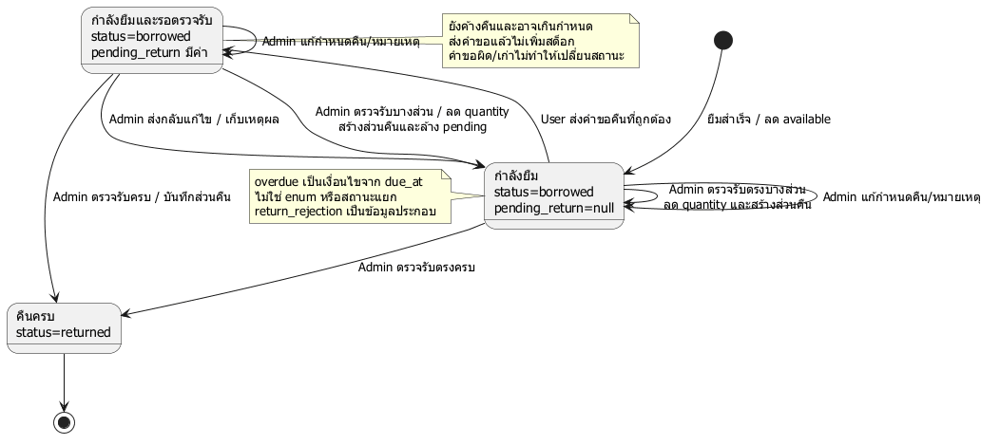

### ภาพที่ 5.2 State Diagram — ส่วนคืน

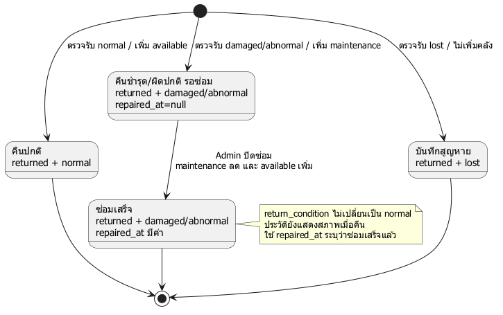

## หมายเหตุเมื่อคัดลอกลงรายงาน

- หากใช้ Use Case ภาพ 1.1 และ 1.2 แทนภาพรวม ให้อธิบายว่าเป็นสองมุมมองของระบบเดียวกัน ไม่ใช่สองระบบ
- สำหรับ Class Diagram เมธอดเป็นการวิเคราะห์เชิงวัตถุ ไม่ใช่รายชื่อ JavaScript methods ที่มีในโปรเจกต์
- Sequence ระดับ OOA ใช้ภาพ 3.1; ภาพ 3.2–3.4 เป็นรายละเอียดออกแบบและการทำงานจริง
- ตาราง Use Case รายตัวคัดลอกจาก `uml-use-case-specifications.md`; อย่าใช้ตารางสรุปใน `uml-system.md` แทนหากต้องส่งตามรูปแบบ Main/Exceptional Flow ของบทเรียน
- รายละเอียดกฎธุรกิจ ตัวอย่างจำนวน และข้อจำกัดอยู่ใน [เอกสาร UML ฉบับเต็ม](uml-system.md)
