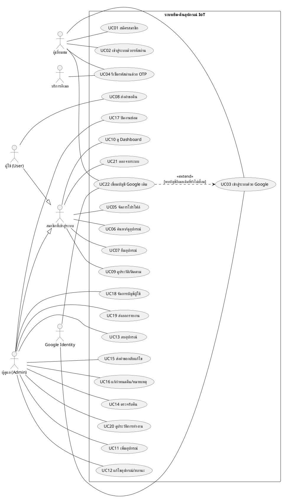
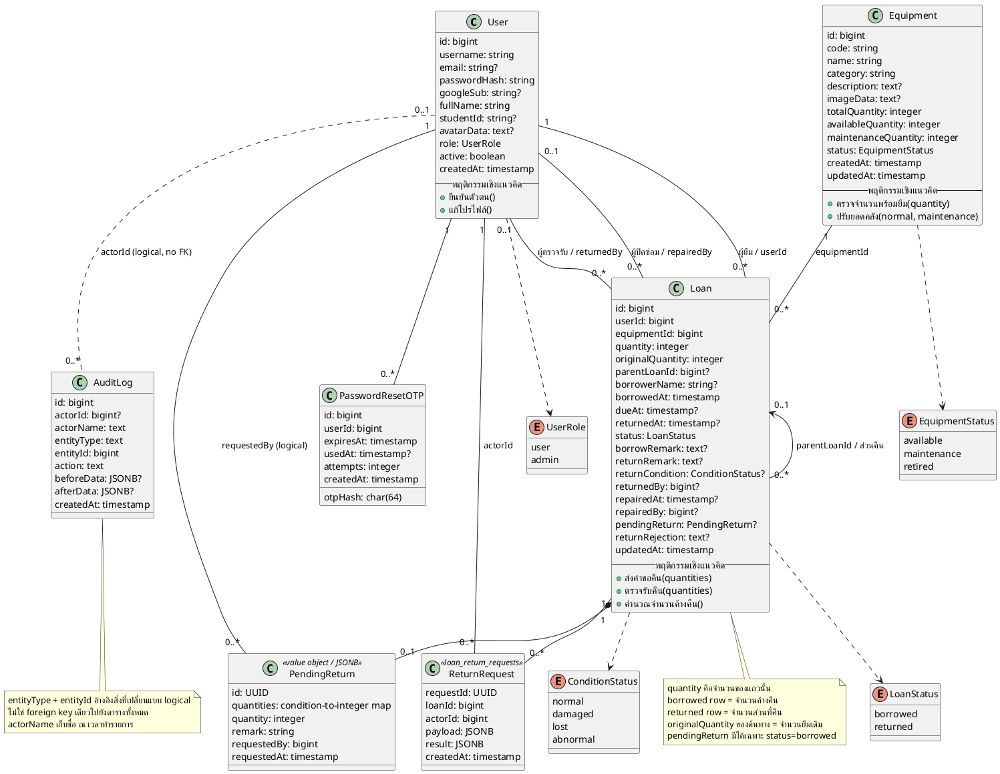
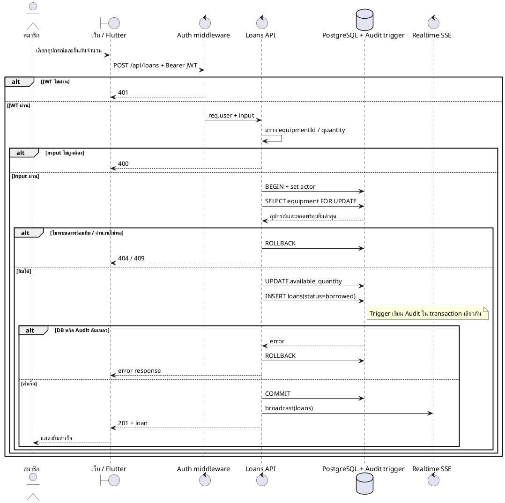
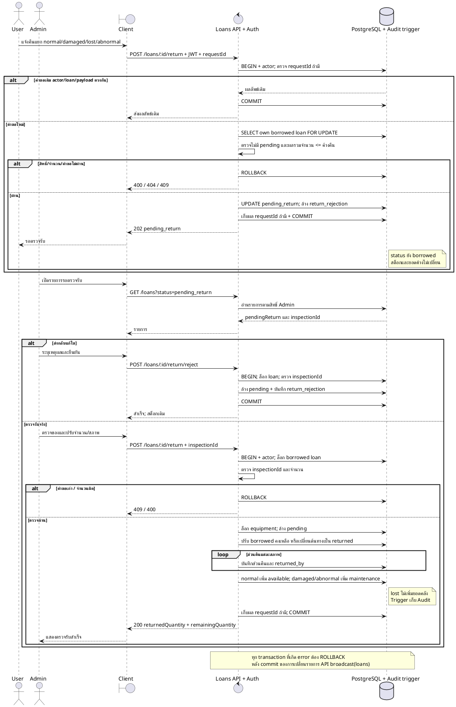
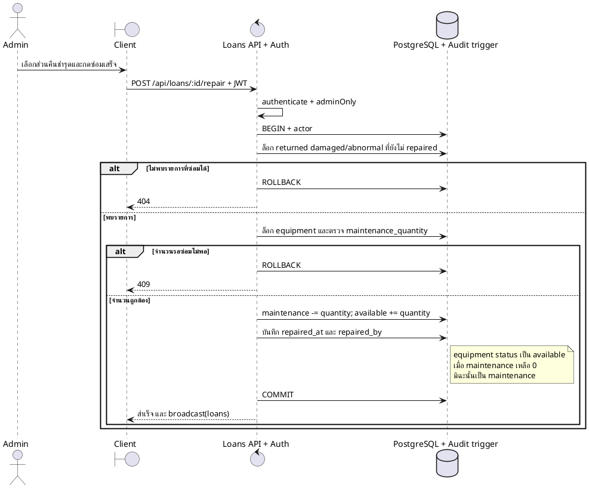
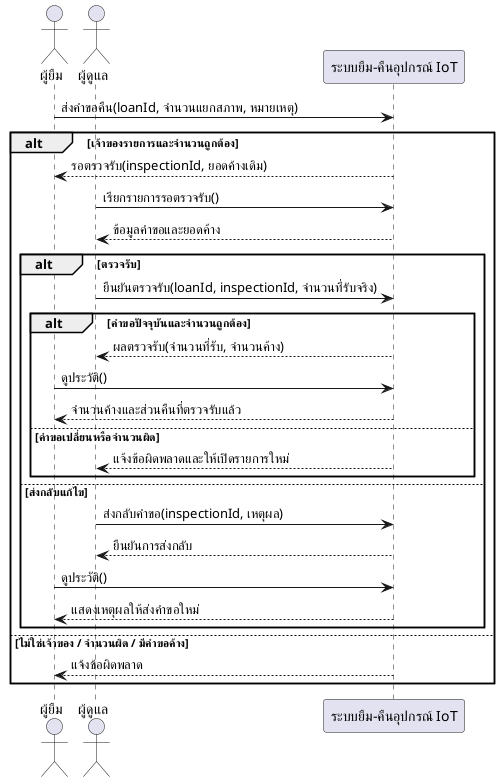
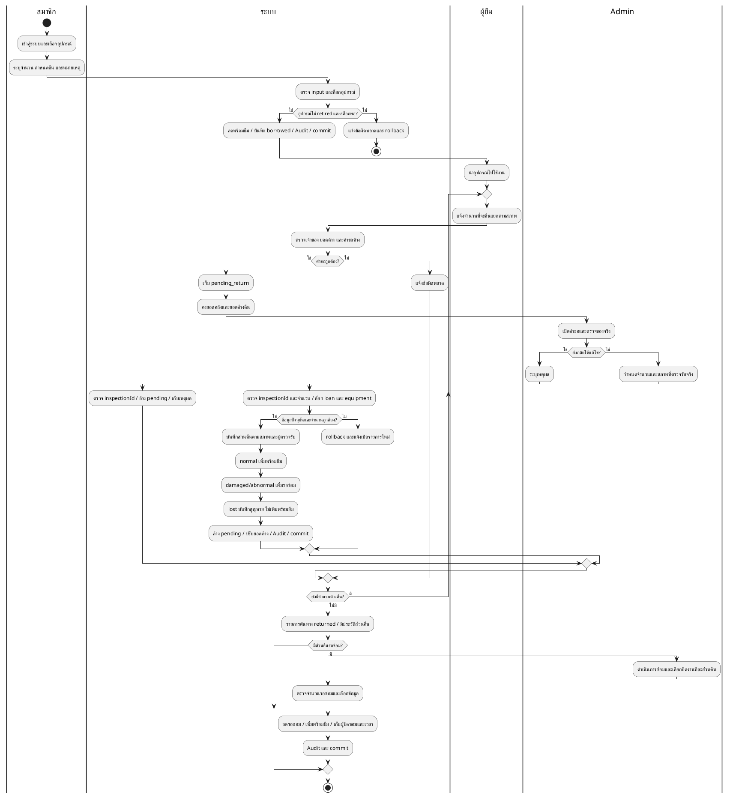
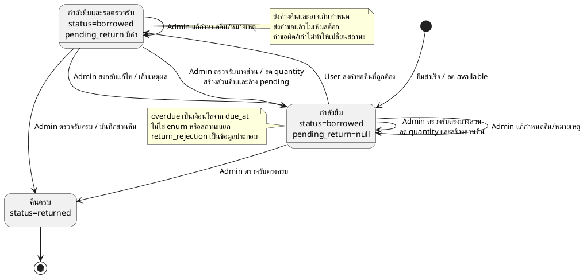
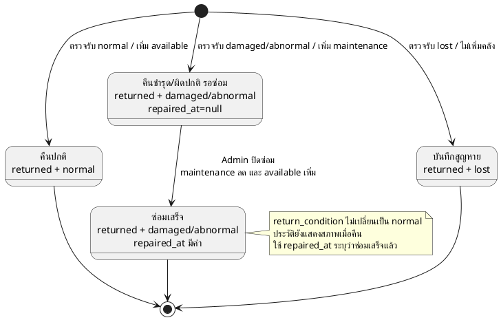

# UML และรายละเอียดระบบยืม–คืนอุปกรณ์ IoT

เอกสารวิเคราะห์จากโค้ดใน C:\IOT ณ วันที่ 2 ตุลาคม 2569 สำหรับประกอบรายงานและออกแบบระบบ โดยรวม schema และ migration 011–012 ซึ่งเพิ่มการคืนบางส่วน ประวัติการทำงาน และการตรวจรับคืน

## 1. ระบบมีอะไรบ้าง

ระบบจัดการคลังและการยืม–คืนอุปกรณ์ IoT เช่น บอร์ดและเซนเซอร์ ผ่านเว็บแอป/PWA และมีไคลเอนต์ Flutter ในโปรเจกต์ หน้าที่หลักคือควบคุมจำนวนพร้อมยืม ติดตามของค้างคืน ตรวจรับสภาพของที่คืน และบันทึกการซ่อม

คำว่า IoT ในโปรเจกต์นี้หมายถึงประเภทอุปกรณ์ที่จัดการ จากโค้ดที่ตรวจสอบยังไม่พบกระบวนการอ่านค่าเซนเซอร์ ควบคุมอุปกรณ์ระยะไกล หรือสื่อสาร MQTT จึงไม่เพิ่มสิ่งเหล่านี้ใน UML

### 1.1 ผู้เกี่ยวข้อง

| Actor | ความหมาย | สิทธิ์/หน้าที่ |
|---|---|---|
| ผู้เยี่ยมชม | ผู้ที่ยังไม่เข้าสู่ระบบ | สมัครสมาชิก เข้าสู่ระบบ ขอ OTP และตั้งรหัสผ่านใหม่ |
| ผู้ใช้ (User) | บัญชีบทบาท user โดยทั่วไปเป็นนักศึกษา | ดูคลัง ยืม ส่งคำขอคืน ดูประวัติตนเอง ดู Dashboard และแก้โปรไฟล์ |
| ผู้ดูแล (Administrator) | บัญชีบทบาท admin | ใช้ฟังก์ชันร่วม และจัดการคลัง ผู้ใช้ ตรวจรับคืน กำหนดคืน ซ่อม รายงาน และ Audit |
| Google Identity | ระบบภายนอก | ให้ข้อมูลยืนยันตัวตนสำหรับเข้าสู่ระบบ/เชื่อมบัญชี |
| บริการอีเมล | ระบบภายนอก | ส่ง OTP เพื่อรีเซ็ตรหัสผ่าน |

ฐานข้อมูลเป็นส่วนภายในระบบ จึงไม่เป็น Actor ใน Use Case Diagram

### 1.2 โมดูลและข้อมูล

| โมดูล | ฟังก์ชัน | ข้อมูลหลัก |
|---|---|---|
| บัญชีและการยืนยันตัวตน | สมัคร เข้าสู่ระบบด้วยรหัสผ่าน/Google เชื่อม Google ลืมรหัสผ่าน ออกจากระบบ | users, password_reset_otps |
| โปรไฟล์ | แก้ข้อมูลส่วนตัว เปลี่ยนรูป | users |
| คลังอุปกรณ์ | ค้นหา ดูจำนวน เพิ่ม แก้ไข ลบ เปลี่ยนสถานะ | equipment |
| ยืม | เลือกอุปกรณ์ ระบุจำนวน ชื่อผู้ยืม กำหนดคืน หมายเหตุ | loans, equipment |
| คืนและตรวจรับ | ส่งจำนวนแยกสภาพ ตรวจรับบางส่วน ส่งกลับแก้ไข ตรวจรับหน้าเคาน์เตอร์ | loans.pending_return, return_rejection, loan_return_requests |
| ติดตาม | ประวัติ รายการค้างคืน เกินกำหนด รอตรวจรับ แก้กำหนดคืน | loans |
| ซ่อมบำรุง | ดูของชำรุด/ผิดปกติและปิดงานซ่อม | loans.repaired_at/repaired_by, equipment.maintenance_quantity |
| Dashboard | สรุปจำนวนอุปกรณ์ พร้อมยืม ยืมอยู่ รอซ่อม เลิกใช้ สูญหาย และเกินกำหนด | equipment, loans |
| ผู้ใช้งาน | ค้นหา แก้ข้อมูล เปลี่ยนบทบาท เปิด/ปิดบัญชี | users |
| รายงาน | ส่งออกประวัติยืม–คืนและซ่อมเป็น CSV เปิดด้วย Excel ได้ | ข้อมูล API ที่แสดงบนเว็บ |
| ประวัติการทำงาน | ค้นหา/กรองผู้ทำรายการและค่าก่อน–หลัง | audit_logs |
| ส่วนสนับสนุน | สลับไทย/อังกฤษ ติดตั้ง PWA อัปเดตหน้าเว็บผ่าน SSE | localStorage, service worker, realtime |

### 1.3 กฎสำคัญที่ UML ต้องสื่อ

1. มีบทบาท user และ admin; User อ่านรายการยืมของตนเอง ส่วน Admin อ่านทั้งหมด
2. การยืมไม่ต้องรอ Admin อนุมัติ: เมื่อข้อมูลผ่านและสต็อกพอ ระบบบันทึกยืมและลดจำนวนพร้อมยืมทันที
3. เงื่อนไขยืมใน API คืออุปกรณ์ไม่เป็น retired และ available_quantity มากกว่า 0; อุปกรณ์สถานะ maintenance ยังยืมส่วนที่พร้อมยืมได้
4. การยืมล็อกแถวอุปกรณ์และทำงานใน transaction เพื่อป้องกันยืมเกินจำนวน
5. User ส่งคำขอคืนแล้วจะรอตรวจรับ ยังไม่เพิ่มสต็อกและยังไม่ลดจำนวนค้างคืน
6. สภาพคืนมี normal, damaged, lost และ abnormal; ผลรวมต้องเป็นจำนวนเต็ม 1 ถึงจำนวนค้างคืน
7. Admin ปรับจำนวนและสภาพตามของจริงก่อนตรวจรับได้ รวมถึงตรวจรับตรงโดยไม่มีคำขอจาก User
8. ของปกติเพิ่ม available_quantity; ของชำรุด/ผิดปกติเพิ่ม maintenance_quantity; ของสูญหายไม่เพิ่มทั้งสองจำนวน
9. คืนบางส่วนแล้วจำนวนที่เหลือยังยืมอยู่; ส่วนที่คืนถูกแยกเป็นแถว returned ตามสภาพโดยอ้างอิงรายการต้นทาง
10. เมื่อคืนครบ แถวต้นทางเปลี่ยนเป็น returned สำหรับส่วนแรก และสร้างแถวเพิ่มหากมีหลายสภาพ ไม่สร้างสถานะ partial_return ใน enum loans
11. pending_return เป็น JSONB ไม่ใช่ค่าใน enum loan_status; status จริงยังเป็น borrowed ระหว่างรอตรวจรับ
12. เกินกำหนดคำนวณจาก status=borrowed และ due_at น้อยกว่าเวลาปัจจุบัน ไม่ใช่สถานะใหม่ในฐานข้อมูล
13. เมื่อส่งกลับแก้ไขต้องมีเหตุผล ไม่เปลี่ยนสต็อก และ User ส่งคำขอใหม่ได้
14. inspectionId ป้องกันตรวจรับคำขอเก่า; requestId ใช้ป้องกันบันทึกคำขอเดิมซ้ำเมื่อไคลเอนต์ส่งค่านี้
15. ปิดงานซ่อมได้เฉพาะส่วน returned ที่ damaged/abnormal และยังไม่มี repaired_at; ปิดงานแล้วลดรอซ่อมและเพิ่มพร้อมยืม
16. อุปกรณ์ที่มีรายการกำลังยืมหรือมีประวัติอ้างอิงลบไม่ได้ ใช้สถานะ retired เมื่อเลิกใช้งาน
17. Audit ของการแก้ไขคลัง รายการยืม และบัญชีที่มี trigger อยู่ใน transaction เดียวกัน หากเขียน Audit ไม่สำเร็จ การแก้ข้อมูลนั้นย้อนกลับ
18. returned_by หมายถึงผู้ดูแลที่บันทึกตรวจรับ ไม่ได้ยืนยันบุคคลที่นำอุปกรณ์มาส่งจริง

## 2. Use Case Diagram

ใช้ PlantUML เพราะรองรับ Actor, ขอบเขตระบบ และความสัมพันธ์ Use Case โดยตรง ทุก Use Case ที่ต้องเข้าสู่ระบบถือว่าการยืนยันตัวตนเป็นเงื่อนไขก่อนเริ่ม ไม่วาด include ไปที่ Login ทุกกรณี

Admin ใช้ API ยืมได้ด้วย บัญชีที่เข้าสู่ระบบจึงเชื่อม UC07 ร่วมกัน ส่วน Admin ที่กดคืนจะดำเนินการตรวจรับ UC14 โดยตรง แทนการสร้างคำขอรอตรวจรับ UC08

## 3. ตารางอธิบาย Use Case

ตารางนี้ระบุผู้กระทำ เงื่อนไขก่อนเริ่ม ลำดับปกติ ผลลัพธ์ และข้อยกเว้นของทุก Use Case ในแผนภาพ คำว่า “เข้าสู่ระบบ” หมายถึงมี JWT ที่ตรวจสอบผ่าน และกรณี Admin ต้องผ่านการตรวจบทบาทด้วย

**ตารางราย Use Case แบบเต็มทั้ง 22 รายการ** พร้อม Primary Actor, Stakeholder Actor, Trigger, Preconditions, Main Flow, Exceptional Flow และ Postconditions อยู่ใน [uml-use-case-specifications.md](uml-use-case-specifications.md) ตารางด้านล่างเป็นดัชนีสรุปสำหรับเปิดเทียบอย่างรวดเร็ว

| รหัส / Use Case | Actor / เงื่อนไขก่อนเริ่ม | ลำดับเหตุการณ์หลัก | ผลลัพธ์หลังสำเร็จ | ทางเลือก / กรณีผิดพลาด |
|---|---|---|---|---|
| UC01 สมัครสมาชิก | ผู้เยี่ยมชม | 1. กรอกชื่อบัญชี อีเมล รหัสผ่าน ชื่อและรหัสนิสิต 2. ตรวจรูปแบบและข้อมูลซ้ำ 3. hash รหัสผ่าน 4. สร้าง users บทบาท user | มีบัญชีใหม่สำหรับเข้าสู่ระบบ | ชื่อบัญชีสั้นกว่า 4 ตัว รหัสผ่านสั้นกว่า 8 ตัว หรืออีเมลผิด: 400; ชื่อบัญชี/อีเมลซ้ำ: 409 |
| UC02 เข้าสู่ระบบด้วยรหัสผ่าน | ผู้เยี่ยมชม มีบัญชี | 1. กรอกข้อมูล 2. ค้นหาบัญชีที่ใช้งานได้ 3. ตรวจ bcrypt 4. ออก JWT 5. เปิดเมนูตามบทบาท | ได้ session สำหรับเรียก API | บัญชีหรือรหัสผ่านไม่ถูกต้อง: 401; เมื่อ JWT หมดอายุต้องเข้าสู่ระบบใหม่ |
| UC03 เข้าสู่ระบบด้วย Google | ผู้เยี่ยมชม; ตั้งค่า Google client แล้ว | 1. รับ challenge/nonce 2. ผู้ใช้เลือก Google 3. ตรวจลายเซ็น token, audience, issuer, expiry, nonce และอีเมล 4. ค้นหาบัญชี 5. ออก JWT | เข้าสู่ระบบด้วยบัญชีที่เชื่อมหรือสร้างใหม่เป็น user | พบอีเมลเดิม: UC22; token ไม่ถูกต้อง/บัญชีปิดใช้งาน/เรียกถี่เกิน: ปฏิเสธ; การสร้างใหม่อัตโนมัติจำกัดตามเงื่อนไข Gmail/Workspace ในโค้ด |
| UC04 รีเซ็ตรหัสผ่านด้วย OTP | ผู้เยี่ยมชม มีอีเมลบัญชีที่ active | 1. ขอ OTP 2. ส่งรหัส 6 หลักทางอีเมล 3. กรอก OTP และรหัสผ่านใหม่ 4. ตรวจ OTP 5. hash รหัสผ่านใหม่และทำเครื่องหมายใช้รหัสแล้ว | เปลี่ยนรหัสผ่านแล้ว ต้องเข้าสู่ระบบ | OTP อายุ 5 นาที จำกัดการตรวจผิด 5 ครั้ง; ขอได้ไม่เกิน 3 ครั้งใน 15 นาทีและเว้น 60 วินาที; ส่งอีเมลล้มเหลว: 503; บัญชีไม่พบตอบข้อความทั่วไป |
| UC05 จัดการโปรไฟล์ | สมาชิกเข้าสู่ระบบ | 1. เปิดบัญชี 2. แก้ข้อมูลที่ฟอร์มรองรับหรือเลือกรูป 3. ตรวจข้อมูล 4. บันทึก users | โปรไฟล์เปลี่ยน | ชื่อบัญชีต้อง 4–50 ตัวตามรูปแบบที่ API อนุญาต; ชื่อซ้ำ: 409; รูปต้อง JPG/PNG/WebP ไม่เกิน 2 MB |
| UC06 ค้นหา/ดูอุปกรณ์ | สมาชิกเข้าสู่ระบบ | 1. เปิดคลัง/หน้ารายการ 2. ระบุคำค้น 3. อ่านรายการและรายละเอียด 4. ดูจำนวน/สถานะ | ได้ข้อมูลอุปกรณ์ปัจจุบัน | ไม่พบให้รายการว่าง; ไม่ผ่าน session: 401 |
| UC07 ยืมอุปกรณ์ | สมาชิกเข้าสู่ระบบ; อุปกรณ์ไม่ retired และจำนวนพร้อมยืมเพียงพอ | 1. เลือกอุปกรณ์ 2. กรอกจำนวน กำหนดคืน ชื่อ/หมายเหตุ 3. ตรวจข้อมูล 4. ล็อกอุปกรณ์ 5. ลด available_quantity 6. สร้าง loans และ Audit 7. commit | มีรายการ borrowed และสต็อกพร้อมยืมลดลง | จำนวนไม่ถูกต้อง: 400; ไม่มีของพร้อมยืม: 404; สต็อกไม่พอ: 409; transaction ล้มเหลว: rollback |
| UC08 ส่งคำขอคืน | User เป็นเจ้าของรายการ borrowed และไม่มีคำขอค้าง | 1. เลือกรายการ 2. ระบุจำนวนแต่ละสภาพและหมายเหตุ 3. ตรวจสิทธิ์และจำนวน 4. บันทึก pending_return พร้อมผู้แจ้ง/เวลา 5. บันทึกผล requestId หากส่งมา | ตอบ 202 รอตรวจรับ; ยอดค้างและสต็อกเดิม | คืนเกินยอด/จำนวนผิด: 400; ไม่ใช่เจ้าของ/ไม่พบ: 404; มีคำขอค้าง: 409; ส่งซ้ำด้วย requestId และ payload เดิมได้ผลเดิม |
| UC09 ดูประวัติ/ติดตาม | สมาชิกเข้าสู่ระบบ | 1. เปิดประวัติหรือติดตาม 2. ค้นหา/กรอง 3. อ่านรายการและส่วนคืน 4. แสดงเกินกำหนด/รอตรวจรับ/เหตุผลส่งกลับ | User เห็นของตน; Admin เห็นทั้งหมด | รอตรวจรับยังนับค้างและเกินกำหนดตาม due_at; rootLoanId ใช้เชื่อมส่วนคืนกับรายการต้นทาง |
| UC10 ดู Dashboard | สมาชิกเข้าสู่ระบบ | 1. เปิดหน้าตรวจเช็ค 2. อ่านยอดคลังและรายการยืม 3. แสดงสรุป | เห็นจำนวนและประเด็นที่ต้องติดตาม | ยอดคลังเป็นภาพรวม; activeLoans/overdueLoans/issueReports จำกัดตามเจ้าของสำหรับ User; API ใช้ activeLoans เป็นจำนวนชิ้น และ overdueLoans เป็นจำนวนแถว |
| UC11 เพิ่มอุปกรณ์ | Admin เข้าสู่ระบบ | 1. กรอกรหัส ชื่อ หมวด รายละเอียด รูป จำนวน สถานะ 2. ตรวจข้อมูล 3. เพิ่ม equipment 4. บันทึก Audit | จำนวนพร้อมยืมเริ่มเท่าจำนวนรวม | รหัสซ้ำ: 409; จำนวนหรือข้อมูลไม่ผ่าน: 400 |
| UC12 แก้ไขอุปกรณ์/สถานะ | Admin; มีอุปกรณ์ | 1. เปิดรายการ 2. แก้รายละเอียด จำนวนรวม หรือ available/maintenance/retired 3. ตรวจข้อจำกัดจำนวน 4. บันทึกพร้อม Audit | รายละเอียดใหม่; available_quantity ปรับตามส่วนต่าง total_quantity | ลดจำนวนจนพร้อมยืมติดลบหรือผิด CHECK ของฐานข้อมูลไม่ได้; รหัสซ้ำ: 409 |
| UC13 ลบอุปกรณ์ | Admin; อุปกรณ์ไม่มีรายการยืมและไม่มีประวัติอ้างอิง | 1. เลือกอุปกรณ์และยืนยัน 2. ตรวจรายการ borrowed 3. ลบและ Audit | อุปกรณ์ถูกลบ | กำลังถูกยืมหรือมี FK ประวัติ: 409; ไม่พบ: 404; หากมีประวัติให้เปลี่ยนเป็น retired ผ่าน UC12 |
| UC14 ตรวจรับคืน | Admin; มีรายการ borrowed; ถ้ามี pending ต้องส่ง inspectionId ปัจจุบัน | 1. เปิดคำขอหรือรับหน้าเคาน์เตอร์ 2. ตรวจของจริง 3. ปรับจำนวน/สภาพ 4. ล็อกรายการและอุปกรณ์ 5. แยกส่วนคืนและปรับยอดค้าง 6. เพิ่มพร้อมยืม/รอซ่อมตามสภาพ 7. ล้าง pending 8. Audit และ commit | บันทึกผู้ตรวจรับ/วันคืน; ถ้าเหลือยัง borrowed ถ้าครบ returned | inspectionId เก่า: 409; จำนวนผิด: 400; ไม่พบ borrowed: 404; Audit/DB ล้มเหลว: rollback |
| UC15 ส่งคำขอกลับแก้ไข | Admin; มี pending ปัจจุบัน | 1. เปิดคำขอ 2. ระบุเหตุผล 3. ส่ง inspectionId 4. บันทึก return_rejection และล้าง pending 5. commit | User เห็นเหตุผลและส่งใหม่ได้; สต็อก/ยอดค้างเดิม | เหตุผลว่าง: 400; คำขอเปลี่ยน/ไม่มี pending: 409 |
| UC16 แก้กำหนดคืน/หมายเหตุ | Admin; มีรายการยืม | 1. เปิดรายการ 2. แก้ due_at และ borrow_remark 3. บันทึกพร้อม Audit | กำหนดคืนและหมายเหตุเปลี่ยน; การแสดงเกินกำหนดคำนวณใหม่ | ไม่พบ: 404; User ไม่มีสิทธิ์: 403; API ไม่ได้จำกัดเฉพาะ borrowed |
| UC17 ปิดงานซ่อม | Admin; ส่วนคืน damaged/abnormal และ repaired_at ว่าง | 1. เลือกรายการซ่อม 2. ล็อก loans/equipment 3. ตรวจจำนวนรอซ่อม 4. ลด maintenance และเพิ่ม available 5. บันทึก repaired_at/repaired_by 6. Audit และ commit | ส่วนคืนซ่อมเสร็จ ของกลับพร้อมยืม | ซ่อมแล้ว/ไม่เข้าเงื่อนไข: 404; จำนวนคลังรอซ่อมไม่พอ: 409; ระบบบันทึกปิดซ่อมทั้งจำนวนของแถวนั้น |
| UC18 จัดการบัญชีผู้ใช้ | Admin เข้าสู่ระบบ | 1. ค้นหาชื่อ/บัญชี/อีเมล/รหัสนิสิต 2. ดูยอดยืม 3. แก้ชื่อ อีเมล รหัสนิสิต role และ active 4. บันทึก Audit | ข้อมูลและสิทธิ์บัญชีเปลี่ยน | ไม่อนุญาตปิดบัญชีตัวเองหรือลดสิทธิ์ Admin ที่กำลังทำรายการ: 400; อีเมลผิด/ซ้ำ: 400/409; ไม่มี API ลบบัญชีในโมดูลนี้ |
| UC19 ส่งออกรายงาน | Admin ใช้หน้าเว็บ | 1. เลือกประวัติยืมหรือซ่อม 2. ระบุช่วงวันที่ตามแบบฟอร์ม 3. อ่านข้อมูล 4. สร้าง CSV UTF-8 5. ดาวน์โหลด | ได้ไฟล์ CSV เปิดใน Excel ได้ มีส่วนคืนและผู้บันทึก | รายงานซ่อมเลือกทั้งหมดได้; วันที่รายงานซ่อมอิงวันคืน หรือวันยืมหากยังไม่คืน; rootLoanId ช่วยตรวจย้อนกลับ |
| UC20 ดูประวัติการทำงาน | Admin เข้าสู่ระบบ | 1. เปิด Audit 2. ค้นหาผู้ทำรายการ/รหัสและกรองประเภท 3. อ่านเหตุการณ์และค่าก่อน–หลัง 4. โหลดหน้าถัดไป | ตรวจย้อนหลังได้ครั้งละ 50 รายการ | ไม่มี API แก้/ลบ Audit; ข้อมูลทำโดยตรงใน DB ที่ไม่มี actor แสดงระบบ/ไม่ระบุ; ไม่เก็บรหัสผ่าน Google subject และเนื้อหารูป |
| UC21 ออกจากระบบ | สมาชิกมี session ในไคลเอนต์ | 1. กดออก 2. หยุดการติดตาม realtime 3. ลบ token/user ใน localStorage 4. แสดง Login | ไคลเอนต์ออกจาก session | เป็นการล้าง session ฝั่งไคลเอนต์ ไม่มี endpoint revoke JWT ในโค้ดที่ตรวจ |
| UC22 เชื่อมบัญชี Google เดิม | ผู้เยี่ยมชม ผ่าน Google และพบอีเมลของบัญชีเดิม | 1. ระบบแจ้ง linkingRequired 2. กรอกรหัสผ่านบัญชีระบบเดิม 3. ตรวจ bcrypt 4. บันทึก google_sub 5. ออก session | บัญชีเดิมใช้ Google เข้าสู่ระบบได้ | รหัสผ่านผิด: 401; บัญชีผูก Google อื่นแล้ว: 409; บัญชีปิดใช้งาน: 403 |

### 3.1 ตัวอย่างรายละเอียด UC07 สำหรับแบบฟอร์มรายงาน

| หัวข้อ | รายละเอียด |
|---|---|
| ชื่อ | UC07 ยืมอุปกรณ์ |
| เป้าหมาย | ให้ผู้ใช้งานนำอุปกรณ์ไปใช้งานและติดตามจำนวนค้างคืนได้ |
| Trigger | ผู้ใช้งานกดยืนยันยืม |
| Input | equipmentId, quantity, dueAt, borrowerName, remark |
| Preconditions | JWT ผ่าน; จำนวนเป็นจำนวนเต็มบวก; มีอุปกรณ์ที่ไม่ retired และสต็อกพอ |
| Main flow | ตรวจ input → BEGIN → กำหนด actor → SELECT equipment FOR UPDATE → ตรวจสต็อก → ลด available → INSERT borrowed loan → trigger Audit → COMMIT → ส่งข้อมูลสำเร็จและ broadcast |
| Alternate flow | ผู้ใช้งานอื่นยืมก่อน: ตรวจยอดหลังล็อกและปฏิเสธเมื่อไม่พอ |
| Exception flow | DB หรือ trigger ล้มเหลว: ROLLBACK; คืนข้อผิดพลาด |
| Postconditions | สต็อกลดตามจำนวนยืม มี loans และ Audit ที่เกี่ยวข้อง |
| Business rule | ไม่ใช้กระบวนการอนุมัติการยืมจาก Admin |

### 3.2 ตัวอย่างรายละเอียด UC08 และ UC14

| หัวข้อ | UC08 ส่งคำขอคืน | UC14 ตรวจรับคืน |
|---|---|---|
| เป้าหมาย | แจ้งจำนวนและสภาพที่จะคืน | รับรองจำนวนและสภาพของจริงและปรับคลัง |
| Trigger | User กดส่งคำขอ | Admin กดยืนยันตรวจรับ |
| Input | loanId, quantities, remark, requestId ถ้ามี | loanId, quantities, remark, inspectionId เมื่อมี pending, requestId ถ้ามี |
| Preconditions | เป็นเจ้าของ borrowed และไม่มี pending | Admin; มี borrowed; inspectionId ตรงคำขอปัจจุบัน |
| Main flow | ล็อก loan → ตรวจยอด → เก็บ pending JSON → commit → 202 | ล็อก loan → ตรวจคำขอ/ยอด → ล็อก equipment → แยกส่วนคืน → ปรับยอดคลัง → ล้าง pending → commit → 200 |
| Alternate flow | ส่งใหม่หลังถูกส่งกลับแก้ไข | ตรวจรับหน้าเคาน์เตอร์โดยไม่มี pending; ตรวจรับน้อยกว่าที่ User แจ้ง |
| Exception flow | จำนวนเกิน/มี pending/ไม่ใช่เจ้าของ | คำขอเก่า/จำนวนผิด/DB ล้มเหลว |
| Postconditions | สต็อกและจำนวนค้างไม่เปลี่ยน | ของปกติกลับคลัง ของเสียรอซ่อม ของสูญหายบันทึกประวัติ จำนวนที่ไม่ได้ตรวจรับยังค้าง |

## 4. Class Diagram

เป็น **Domain Class Diagram ที่อิงข้อมูลจริง** ไม่ได้หมายความว่า JavaScript มี class เหล่านี้ทุกตัว โค้ดจริงใช้ Express route และ SQL พฤติกรรมเชิงแนวคิดที่เพิ่มด้านล่างเป็นหน้าที่ของโดเมนตามการวิเคราะห์ OOA/OOD ซึ่ง route ปัจจุบันดำเนินการแทน ไม่ใช่เมธอดที่ประกาศอยู่ใน class JavaScript PendingReturn เป็น value object ใน JSONB ไม่ใช่ตารางแยก

`loan_details` เป็น view สำหรับอ่านรายงาน ไม่ใช่ Entity ที่บันทึกแยก; ข้อมูลชื่ออุปกรณ์อิงคลังปัจจุบัน และชื่อผู้ยืมใช้ borrower_name หากมี ส่วน UI/API ใช้ชื่อ camelCase แต่ฐานข้อมูลใช้ snake_case

## 5. Sequence Diagram

### 5.1 การยืมอุปกรณ์ — UC07

### 5.2 ส่งคำขอคืนและตรวจรับ — UC08, UC14, UC15

Admin ตรวจรับหน้าเคาน์เตอร์ใช้ช่วงตรวจรับจริงได้ทันทีโดยไม่ต้องมีช่วง User ส่งคำขอ; ถ้ามี pending อยู่ต้องตรวจ inspectionId เสมอ

### 5.3 ปิดงานซ่อม — UC17

### 5.4 System Sequence Diagram ระดับ OOA — ส่งคืนและตรวจรับ

ในสไลด์ OOA ระบบถูกมองเป็นกล่องเดียว แผนภาพนี้จึงแสดงคำสั่งที่ Actor ส่งเข้าระบบและผลตอบกลับ ส่วนแผนภาพ 5.1–5.3 อธิบายการทำงานภายในสำหรับ OOD

## 6. Activity Diagram — ยืมจนคืนและซ่อม

แสดงกิจกรรมธุรกิจหลักพร้อม swimlane ไม่ได้แสดงการกระทำทุกอย่างในหน้าโปรไฟล์และการตั้งค่าบัญชี

การซ่อมส่วนที่คืนแล้วทำได้แม้ยังมีส่วนอื่นค้างคืน แผนภาพนี้เรียงหลังคืนครบเพื่อให้อ่านง่าย ไม่ใช่เงื่อนไขบังคับของ API และ Admin สามารถตรวจรับโดยตรงแทนขั้นแจ้งคืนได้

## 7. State Diagram

### 7.1 วงจรธุรกิจของรายการยืมต้นทาง

### 7.2 วงจรของส่วนคืน

สถานะ available/maintenance/retired ของ Equipment เป็นสถานะระดับรายการคลังที่อาจมีหลายชิ้น ไม่ใช่สถานะอุปกรณ์รายชิ้น “พร้อมยืม” ต้องดู available_quantity ร่วมด้วย และ API ปิดซ่อมปัจจุบันคำนวณ status ใหม่จาก maintenance_quantity จึงไม่ควรสมมติว่า retired เป็นสถานะปลายทางที่ย้อนกลับไม่ได้

## 8. ตัวอย่างอธิบายจำนวนให้เห็นภาพ

สมมติอุปกรณ์ทั้งหมด 10 ชิ้น พร้อมยืม 10 รอซ่อม 0 และ User ยืม 5 ชิ้น

| เหตุการณ์ | พร้อมยืม | ยืมค้าง | รอซ่อม | สูญหายที่บันทึก | ผลรายการ |
|---|---:|---:|---:|---:|---|
| ก่อนยืม | 10 | 0 | 0 | 0 | ไม่มีรายการ |
| ยืม 5 | 5 | 5 | 0 | 0 | borrowed quantity=5 |
| แจ้งคืน ปกติ 2 ชำรุด 1 | 5 | 5 | 0 | 0 | pending มีค่า แต่ status ยัง borrowed |
| Admin ตรวจรับตามแจ้ง | 7 | 2 | 1 | 0 | ต้นทาง borrowed quantity=2; ส่วนคืน normal=2, damaged=1 |
| Admin ซ่อมส่วนชำรุดเสร็จ | 8 | 2 | 0 | 0 | ส่วน damaged มี repaired_at |
| แจ้งคืนที่เหลือ ปกติ 1 สูญหาย 1 | 8 | 2 | 0 | 0 | รอตรวจรับครั้งใหม่ |
| Admin ตรวจรับครบ | 9 | 0 | 0 | 1 | ต้นทางเป็น returned พร้อมส่วนคืนครบทุกสภาพ |

total_quantity ยังเป็น 10 เพราะโค้ดตรวจรับ lost ไม่ได้ลดจำนวนรวม ห้ามนับ original_quantity ของทุกแถวรวมกันเป็นยอดยืม ให้พิจารณาปริมาณของแต่ละส่วนและจัดกลุ่มด้วย rootLoanId

## 9. ขอบเขตและข้อสังเกตสำหรับรายงาน

- ไม่มีขั้นอนุมัติคำขอยืม ไม่มีค่าปรับ ไม่มีการจองอุปกรณ์ล่วงหน้า และไม่มีข้อมูลหมายเลขประจำอุปกรณ์รายชิ้นใน schema ที่ตรวจ
- การรายงานสภาพเป็นส่วนของการคืน ส่วนหน้าซ่อมอาจแสดงรายการจากหมายเหตุด้วย แต่ปิดซ่อมผ่าน API ได้เฉพาะ returned damaged/abnormal ที่ยังไม่ซ่อม
- SSE ส่งสัญญาณว่าข้อมูลเปลี่ยนให้หน้าเว็บอ่านใหม่ ไม่ใช่หลักฐานว่ามีอีเมล/SMS แจ้งเตือนเกินกำหนด
- PWA cache หน้าจอ แต่ API และการเข้าสู่ระบบยังต้องติดต่อเซิร์ฟเวอร์
- enum บทบาทอยู่ใน users ไม่จำเป็นต้องสร้างตารางหรือ class Admin แยกใน Domain Model; Actor Admin ใน Use Case หมายถึงบทบาทผู้ใช้งาน
- การตรวจบทบาทใช้ข้อมูล JWT; การปิดบัญชีหรือเปลี่ยนบทบาทไม่เท่ากับเพิกถอน JWT เดิมทันทีทุก endpoint เนื่องจาก middleware ปัจจุบันตรวจ token โดยไม่ได้อ่าน users.active ใหม่ทุกครั้ง
- docs/partial-returns-audit.md เป็นรายละเอียดขั้นก่อนมีตรวจรับ ข้อความเดิมที่ระบุว่ายังไม่มีตรวจรับถูกแทนด้วย migration 012 และ docs/return-inspection.md ในเอกสารนี้

## 10. แหล่งอ้างอิงภายในโปรเจกต์

| เรื่อง | ไฟล์ |
|---|---|
| ภาพรวม | README.md |
| โครงสร้างข้อมูล | database/schema.sql, database/migrations/011_partial_returns_audit.sql, database/migrations/012_return_inspection.sql |
| ยืม คืน ตรวจรับ ส่งกลับ ซ่อม แก้กำหนดคืน | src/routes/loans.js, src/utils/returns.js |
| คลังอุปกรณ์ | src/routes/equipment.js |
| สมัคร Login โปรไฟล์ OTP | src/routes/auth.js |
| Google | src/routes/google-auth.js, src/google-identity.js |
| บัญชีและสิทธิ์ | src/routes/users.js, src/middleware/auth.js |
| Dashboard และ Audit | src/routes/dashboard.js, src/routes/audit.js, src/utils/audit.js |
| รายงานและ realtime | public/management-ui.js, public/app.js, src/realtime.js |
| ขั้นตรวจรับปัจจุบัน | docs/return-inspection.md |

Diagram ทั้งหมดเป็น source PlantUML สำหรับนำไป render เป็นภาพ เอกสารนี้ตรวจความสอดคล้องกับโค้ด แต่ยังไม่ได้ยืนยันการ render ด้วย PlantUML engine
